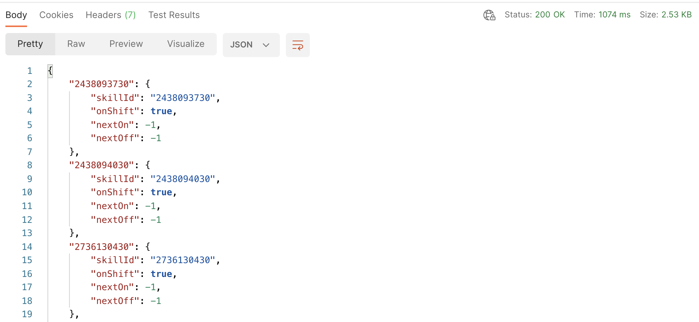

# Shift Status Cache

The purpose of this function is to access data from the Shift Status API and store that data within the Conversation Context Service. Reporting APIs such as Shift Status are not intended for use at a conversational scale. As opposed to accessing the APIs directly from a Conversation Builder bot, this function will cache the data from this API. That data can then be accessed for routing and messaging decisions using bot context methods to access the Conversation Context Service.

This process was originally documented on our [developers forum](https://talkyard.livepersonai.com/-24/caching-shift-status-api-data-w-faas-conversation-context-service).

---

This guide is meant to supplement [Caching Current Queue Health APIs w/ FaaS & Conversation Context Service](https://talkyard.livepersonai.com/-18/caching-current-queue-health-apis-w-faas-the-context-session-store). The concepts and core functionality are all the same, however, because the [Shift Status API](https://developers.liveperson.com/shift-status-api-methods-get-shift-status-by-account.html), along with some other APIs are not supported by the FaaS Toolbelt's `lpClient` method, this guide will highlight where changes need to be made in your approach. Please see the original linked post for details on setting up the Conversation Context Service and understanding how to schedule the FaaS function.

## Preparation to use Login API

The Shift Status by Account API requires a bearer token retrieved from a logged-in bot in order to retrieve shift status information for all account skills. Because we want our FaaS to run periodically without being called from a bot, this means we need to call the Login API with a bot's credentials from our FaaS function to ensure we have a current and valid bearer token when retrieving shift status information. For this example, we'll create a new bot agent and store the needed credentials using FaaS `secretClient` methods.

### Create a new bot agent

In the Conversational Cloud, navigate to the User Management section and create a new bot agent using the same process you would when setting an agent connector. For this example, I've created an agent with a login name of `login-api-faas`.

Fill out the remaining fields of the add user form as you would like. When you reach the "Add login method" section, make sure to select API key, generate a new key, and record the various vital details. You will need the following to retrieve the bearer token in FaaS:

* login name
* App key
* Secret
* Access Token
* Access Token Secret

After recording this information, assign your new bot agent the role of "agent" and save. You do not need to give this bot agent a skill to retrieve the bearer token from it.

### Save Login Credentials in FaaS Secret Storage

1. Navigate into **Functions** using the grid menu in the lower left of Conversational Cloud.

2. Click on the *Secret Storage* menu
3. Click the *Add a secret* button
4. Create a new secret with the following:
   * **Key**: loginCredentials
   * **Type**: JSON

For the value, insert a JSON object with information retrieved previously from your bot agent.

```json
{
 "username": "{{bot username}}",
 "appKey": "{{bot app key}}",
 "secret": "{{bot secret}}",
 "accessToken": "{{bot access token}}",
 "accessTokenSecret": "{{bot access token secret}}"
}
```

Click create when finished.

Also, ensure that you have your Conversation Orchestrator key saved to the secret storage before moving on. For instructions to do so, please see the original guide referenced at the beginning of this document.

## Create the function

Using the same process as the previous guide, create a new function to pull down the shift status API information and save the data to the Context Session Store. The full code of the function is listed below with comments explaining what each piece of the function does.

```js
function lambda(input, callback) {
  // Importing the FaaS Toolbelt
  const { Toolbelt } = require("lp-faas-toolbelt");
  // Obtain an HTTPClient Instance from the Toolbelt
  const httpClient = Toolbelt.HTTPClient(); // For API Docs look @ https://www.npmjs.com/package/request-promise
  // Obtain a secretClient instance from the Toolbelt to access your saved Conversation Orchestrator key
  const secretClient = Toolbelt.SecretClient();
  //  set your account number here
  const accountId = '';

  // The domain & URL to access each resource is environment-specific according to your account number. Use https://developers.liveperson.com/api-guidelines-domain-api.html and enter your account number to retrieve the domain for the referenced resource for each variable

  const loginDomain = ''; //resource: 'agentVep'
  const shiftStatusDomain = ''; //resource: 'asyncMessagingEnt'

  const loginURL = `https://${loginDomain}/api/account/${accountId}/login?v=1.3`;
  const shiftStatusURL = `https://${shiftStatusDomain}/api/account/${accountId}/shift-status`;

  // Variables for Conversation Context Service
  const namespace = ''; // name of the namespace
  const sessionId = '' || undefined; // optional: if not provided will use default session

  // retrieve secrets from secret store
  async function fetchSecret(key) {
    try {
      const secret = await secretClient.readSecret(key);
      return secret.value;
    } catch(err) {
      console.error('err: ' + err);
    }
  }

  // log bot user in to obtain bearer token and pass to shiftStatusByAccount function
  async function loginBotUser(loginCredentials) {
    try {
      const response = await httpClient(loginURL, {
        method: 'POST',
        headers: {
            'Content-Type': 'application/json',
            'Accept': 'application/json',
        },
        simple: false,
        json: true,
        resolveWithFullResponse: false,
        body: loginCredentials
      })
      return response.bearer;
    } catch(err) {
      callback(err);
    }
  }

  // use bearer token to access shift status by account api, format the data, and pass to updateContextWarehouse function
  async function shiftStatusByAccount(token) {
    try {
      const response = await httpClient(shiftStatusURL, {
        method: 'GET',
        headers: {
            'Authorization': `Bearer ${token}`
        },
        simple: false,
        json: true,
        resolveWithFullResponse: false
      })
      return formatShiftStatusData(response);
    } catch(err) {
      callback(err);
    }
  }

  // update global context of context session store at shift-status-api namespace
  async function updateConversationContextService(keyValuePair, secret) {
    const contextClient = Toolbelt.ContextServiceClient({ apiKey: secret, accountId: accountId });
    try {
      const sessionProperties = await contextClient.updatePropertiesInNamespace(namespace, keyValuePair, sessionId);
      console.info(sessionProperties);
      callback(null, `Successfully updated Context Service`);
    } catch(err) {
      callback(err);
    }
  }

  // Format the result to add a timestamp as well as use skill id as key in global context store to make accessing skill id information easier.
  function formatShiftStatusData(shiftStatusData) {
    const currentTime = new Date();
    const formattedData= {timestamp: currentTime};

    shiftStatusData.forEach(skill => {
      const dataObj = skill;
      formattedData[skill.skillId] = dataObj;
    })

    return formattedData;
  }

  async function main() {
    // Retrieve from Secret Storage
    const loginCredentials = await fetchSecret('loginCredentials');
    const mavenApiKey = await fetchSecret('mavenApiKey');
    // Retrieve Bearer Token
    const bearerToken = await loginBotUser(loginCredentials);
    // Retrieve Shift status data
    const shiftStatusData = await shiftStatusByAccount(bearerToken);
    // Update CCS
    updateConversationContextService(shiftStatusData, mavenApiKey);
  }

  main()
}
```

This function does several things, but ultimately it logs a bot agent in, uses that bearer token to call the shift status API, passes that information to a function to format it, and then passes that data to a function to update the Context Session Store. Looking at this data in the Context Session Store using Postman, we see the following:



As you can see, we now have a collection of keys in the global scope of our Context Session Store which map to the skill IDs currently on the account. Additionally, we have a timestamp so that you can see when these values have been last updated. With that in hand, we can now access those values from within Conversation Builder using the provided scripting functions.

## Conclusion

With our function built out and working, set it to a schedule to periodically cache the shift status information in the Conversation Context Service. Once that scheduled FaaS is running, you can pass the namespace and skill ID you want to check to the `getGlobalContextData` function to pull the relevant information into your bot. This will allow you to run a check prior to escalating to a skill to ensure the best possible experience for your users. Please see the attached articles for more information on ways to use the Conversation Context Service and reporting dashboard functions to improve your bot solutions.

[Caching Current Queue Health APIS w/ FaaS & Conversation Context Service](https://talkyard.livepersonai.com/-18/caching-current-queue-health-apis-w-faas-the-context-session-store)
