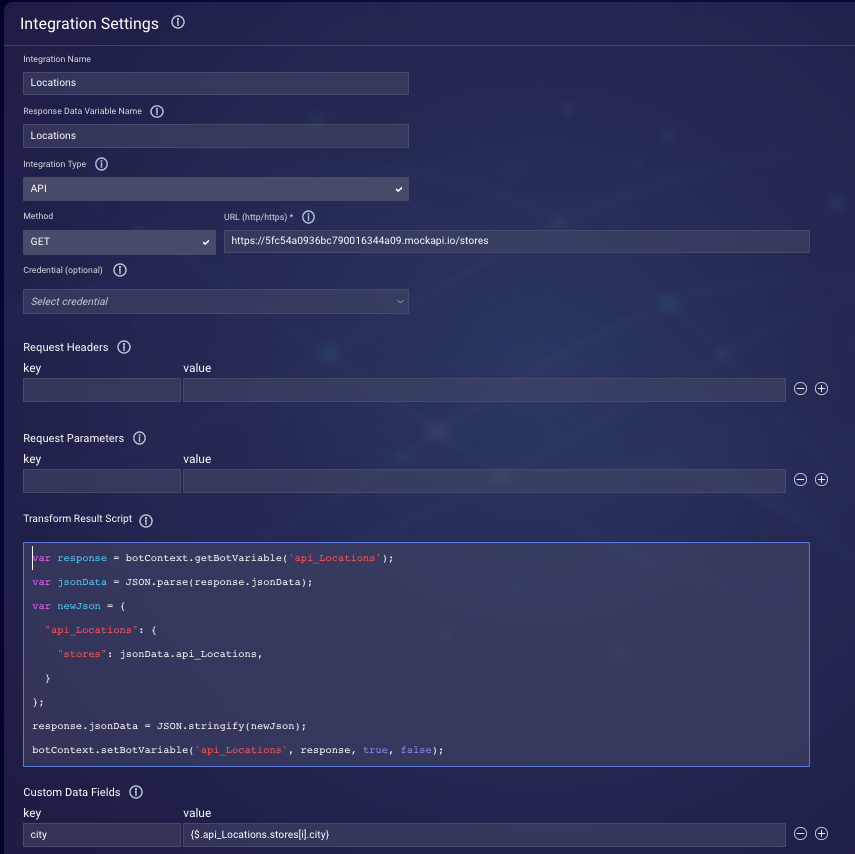
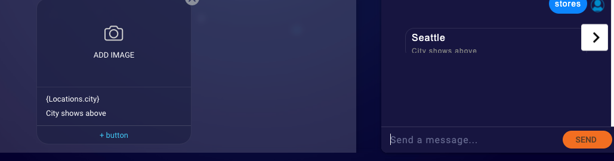

# Adding a top-level key to an API response

> **Note**: This guide originally appeared in the [LivePerson developer forum](https://talkyard.livepersonai.com/-57/adding-a-top-level-key-to-an-api-response).

When processing API responses in Conversation Builder, [Custom Data Fields](https://developers.liveperson.com/conversation-builder-integrations-integration-basics.html#process-api-results-with-custom-data-fields) provide a straightforward way to iterate through the responses to populate structured content. However, the code which creates the custom data fields expects that the API response is in the form of an object. Many API responses will return an array at its top level, which the Custom Data Fields section cannot iterate through.

We can modify the API response using custom code in the "Transform Result Script" of the integration to solve this. Here, we can add a new top-level object with a key that points to our response array, providing us with the capability to iterate through it in the Custom Data Fields.

For this example, we have a "Location" integration accessing a [resource](https://5fc54a0936bc790016344a09.mockapi.io/stores) that returns an array of store objects.

```json
[
  {
    "id": "123456",
    "city": "Seattle",
    "address": "11501 Aurora Ave N",
    "state": "Washington",
    "zip": "98133",
    "weekdayHours": "8am - 6pm",
    "weekendHours": "9am - 5pm",
    "mapImage": "https://image.freepik.com/free-vector/street-map-with-pin-routes_23-2147622544.jpg",
    "googleMapLink": "https://www.google.com/maps/place/11501+Aurora+Ave+N,+Seattle,+WA+98133"
  },
  {
    "id": "789456",
    "city": "Shoreline",
    "address": "15301 Westminster Way N",
    "state": "Washington",
    "zip": "98133",
    "weekdayHours": "8am - 7pm",
    "weekendHours": "9am - 5pm",
    "mapImage": "https://image.freepik.com/free-vector/street-map-with-pin-routes_23-2147622544.jpg",
    "googleMapLink": "https://www.google.com/maps/place/15301+Westminster+Way+N,+Shoreline,+WA+98133"
  },
  {
    "id": "654321",
    "city": "Bothell",
    "address": "1170 205th Pl SE",
    "state": "Washington",
    "zip": "98012",
    "weekdayHours": "8am - 6pm",
    "weekendHours": "10am - 6pm",
    "mapImage": "https://image.freepik.com/free-vector/street-map-with-pin-routes_23-2147622544.jpg",
    "googleMapLink": "https://www.google.com/maps/place/1170+205th+Pl+SE,+Bothell,+WA+98012"
  }
]
```

> The URL for this resource is `https://5fc54a0936bc790016344a09.mockapi.io/stores`

Following the practices in our documentation, one might assume that you should be able to target each store's city using the `{$.api_Locations[i].city}` syntax. However, this syntax fails as the Custom Data Fields do not allow for iterating over the `api_Locations` object.

Our solution will be to construct a new object using the response from the API, providing a top-level key that points to our response array and overwriting the API response object.

## Code

Insert the following code into the "Transform Result Script" editor in your integration (**Note:** You will need to update the API variable name (`api_Locations`) and `"stores"` key with your own API name and choice for the key name.)

```js
var response = botContext.getBotVariable('api_Locations');
var jsonData = JSON.parse(response.jsonData);
var newJson = {
  "api_Locations": {
    "stores": jsonData.api_Locations,
  }
};
response.jsonData = JSON.stringify(newJson);
botContext.setBotVariable('api_Locations', response, true, false);
```


In this code, we first parse out the JSON data from our API response. We then create a new object, called `newJson` where we make a new `"stores"` key pointing to our locations array. Finally, we overwrite the original `jsonData` property of our response with our newly constructed object and re-save the new variable to the `api_Locations` bot variable.

We can now iterate over our new "stores" array and create our custom data fields. For example, if working with this resource, you will now have access to all the location's city property by targeting `{$.api_Locations.stores[i].city}`.


