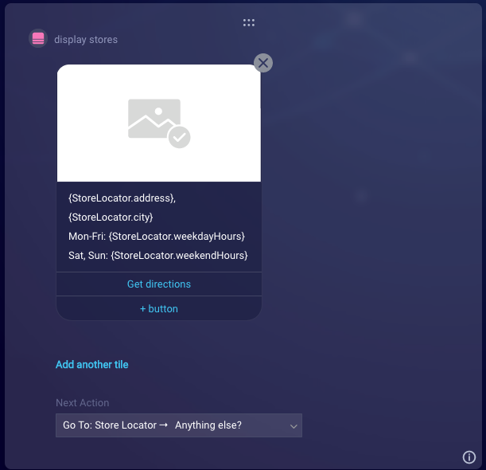
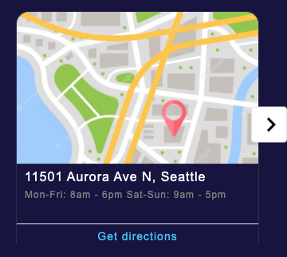
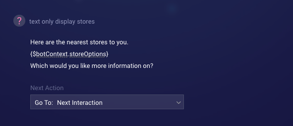
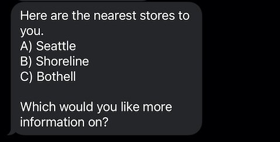
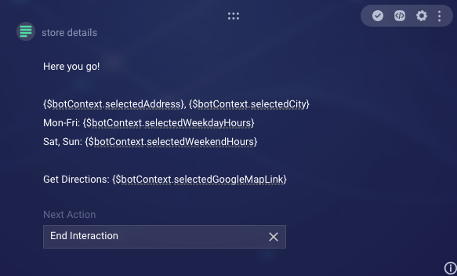
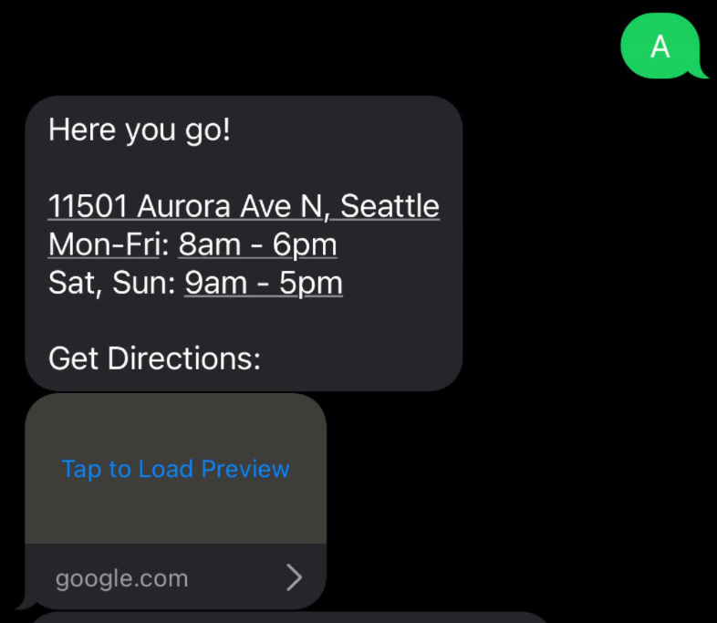

# Displaying Multiple Results in Text-Only Channels

> **Note**: This guide originally appeared in the [LivePerson developer forum](https://talkyard.livepersonai.com/-19/displaying-multiple-results-in-text-only-channels).

Conversation Builder’s structured content interaction provides an excellent way to iterate over results from an API call and display them to your user in an orderly, convenient fashion. However, channels such as SMS and WhatsApp do not support structured content. In order to display multiple results from an API call in a text only channel, some JavaScript is necessary to manually iterate through our results and display them as a text question interaction. For this walkthrough we will be using a Store Locator bot flow, which accesses a mock API Integration to return several store objects. This will serve as our starting point.

## Review of Structured Content Iteration

Prior to looking at how we can implement iterative functionality in a text-only channel, let's quickly review how we are able to iterate over API results to display them in a Structured Content interaction. If you are already well versed in how Structured Content displays this type of data, feel free to skip to the next section.

### The API

In the integrations tab of our bot, we've created a StoreLocator integration which pulls data from a mock API. The integration is comprised of the following details.

* **Integration Name**: `StoreLocator`
* **Response Data Variable Name**: `StoreLocator`
* **Integration Type**: `API`
* **Method**: `GET`
* **URL**: `https://5fc54a0936bc790016344a09.mockapi.io/store-locator/1`

As shown below, the API results contains a `stores` array which we can iterate over when savings as a variable.

```json
{
 "id":"1",
 "stores":[
  {
   "id":"123456",
   "city":"Seattle",
   "address":"11501 Aurora Ave N",
   "state":"Washington",
   "zip":"98133",
   "weekdayHours":"8am - 6pm",
   "weekendHours":"9am - 5pm",
   "mapImage":"https://image.freepik.com/free-vector/street-map-with-pin-routes_23-2147622544.jpg",
   "googleMapLink":"https://www.google.com/maps/place/11501+Aurora+Ave+N,+Seattle,+WA+98133"
  },{
   "id":"789456",
   "city":"Shoreline",
   "address":"15301 Westminster Way N",
   "state":"Washington",
   "zip":"98133",
   "weekdayHours":"8am - 7pm",
   "weekendHours":"9am - 5pm",
   "mapImage":"https://image.freepik.com/free-vector/street-map-with-pin-routes_23-2147622544.jpg",
   "googleMapLink":"https://www.google.com/maps/place/15301+Westminster+Way+N,+Shoreline,+WA+98133"
  },{
   "id":"654321",
   "city":"Bothell",
   "address":"1170 205th Pl SE",
   "state":"Washington",
   "zip":"98012",
   "weekdayHours":"8am - 6pm",
   "weekendHours":"10am - 6pm",
   "mapImage":"https://image.freepik.com/free-vector/street-map-with-pin-routes_23-2147622544.jpg",
   "googleMapLink":"https://www.google.com/maps/place/1170+205th+Pl+SE,+Bothell,+WA+98012"
  }
 ]
}
```

To save this data in a format that can be iterated over and displayed to our user in a Structured Content interaction, we will set the following Custom Data Field key value pairs:

* **city**: `{$.api_StoreLocator.stores[i].city}`
* **weekdayHours**: `{$.api_StoreLocator.stores[i].weekdayHours}`
* **weekendHours**: `{$.api_StoreLocator.stores[i].weekendHours}`
* **mapImage**: `{$.api_StoreLocator.stores[i].mapImage}`
* **address**: `{$.api_StoreLocator.stores[i].address}`
* **state**: `{$.api_StoreLocator.stores[i].state}`
* **zip**: `{$.api_StoreLocator.stores[i].zip}`
* **googleMapLink**: `{$.api_StoreLocator.stores[i].googleMapLink}`

The `[i]` in our JSON is to signify that we will iterate over the `stores` array and save the corresponding value for each index in the array.

### The Structured Content Interaction

With this information in hand, we can display our results in our Structured Content using the `{StoreLocator.<CustomDataFieldName>}` syntax.



The result in our previewer is a carousel of our store objects with the appropriate information for each store displayed together.



While this technique works perfectly for structured content, we do not have the same functionality when trying to display a text interaction. As such, we will need to take advantage of some custom JavaScript in order to manually break apart the JSON response from our API and iterate over that set when crafting our text response.

## Manually Processing API JSON

Since our text only interactions cannot iterate over Custom Data Fields, it is necessary to use some JavaScript code in the Transform Result Script section of our API call. This will allow us to isolate the array which contains our data and save it to a bot variable. The following code parses our StoreLocator API response, isolates the `stores` array which houses our store data, which is then stringified and saved to the bot variable `storeArray`.

```javascript
var getContextData = botContext.getBotVariable("api_StoreLocator");
var getContextJsonResponse = JSON.parse(getContextData.jsonData);
var jsonResponse = getContextJsonResponse.api_StoreLocator.stores;
botContext.setBotVariable('storeArray', JSON.stringify(jsonResponse), true, false);
```

> NOTE: Stringifying your data prior to saving as a bot variable is an essential step when saving any data that is not a primitive data type (numbers, strings, booleans, etc.). Since the API responses are saved in an array, call the `JSON.stringify` method when saving the jsonResponse.

## Displaying the Options

With this array of responses available as a bot variable, the next step will be to iterate through those responses when the bot is to display them in text form. For this purpose, create a new text question interaction that gets routed to after a successful API call. For the purpose of this demonstration, we'll name this interaction `text only display stores`.

In the pre-process code section of our `text only display stores` text question, we'll insert the following JavaScript code:

```js
// Parse store results array from API call
var storeArray = JSON.parse(botContext.getBotVariable('storeArray'));
// Empty string to populate a dynamic list of options for use to choose from. Also including an array for processing user response.
var storeOptions = '';
var optionsArray = [];
// Alphabet string to properly label the options (e.g. A) opt1, B) opt2, etc)
var alphabet = 'ABCDEFGHIJKLMNOPQRSTUVWXYZ';
// Iterate through list building option string as well as options array.
for (var i = 0; i < storeArray.length; i++) {
   var cityName = storeArray[i].city;
   var optionText = alphabet[i] + ') ' + cityName + '\n';
   storeOptions += optionText;
   optionsArray.push(optionText);
}
// Set bot as bot variables.
botContext.setBotVariable('storeOptions', storeOptions, true, false);
botContext.setBotVariable('optionsArray', JSON.stringify(optionsArray), true, false);
```

Let’s step through what this code is doing:

* The first step is to grab our `storeArray` bot variable, parse the string, and store the parsed array as the variable `storeArray`.
* Three additional variables are needed to properly display the results:

  * `storeOptions` is an empty string, which we will be concatenating the text options onto.
  * `alphabet` is a string made up of all capital letters of the alphabet.
  * `optionsArray` is an empty array which will store the options to later match against the user response.
* Next, loop over `storeArray` and for each store object, do the following:
  * Create a `cityName` variable, which is the city property of the object that will be displayed in our multiple choice interaction.
  * Create an `optionText` variable prepended with a letter from our `alphabet` string to mock a multiple choice question. We are also forcing a newline at the end of each string.
  * To finish our loop, add the `optionText` to both the `options` string and `optionsArray`.
* After both of these variables have been populated, set both to bot variables for use in our question display as well as the Process User Response section.

With these new bot variables in hand, text content can be populated dynamically, adding as many options for selection as was returned from our API.

After saving your pre-process code, return to the text content of our `text only display stores` and insert the following:

```md
Here are the nearest stores to you.
{$botContext.storeOptions}
Which would you like more information on?
```



> NOTE: Conversation Builder offers its own multiple choice question option which would degrade to a similar display of text as we have built here. However, multiple choice questions require a static number of options and are not flexible when receiving an unknown number of responses. Our solution above accounts for this and is truly dynamic based on the number of responses.

The resulting content for our users is displayed with the city name of the store alongside a letter. As our question is dependent on a user’s text input, we want to offer flexibility in our program to account for a user responding with either the full text or the letter associated with their selection. To do this, we will once again take advantage of some JavaScript code.



## Processing the User Response

To display more details about our user's selection, let's create a new text message interaction immediately following the `text only display stores`, which we will give the name `store details`. We'll populate the content a bit later on. In addition, create another text message interaction to display in the event we are unable to understand our user's response. Name this interactions `selection fail` and insert the following text content:

```md
I'm having trouble understanding which selection you are looking for. Please respond with either the letter or full name of the store you want information on.
```

As previously noted, extra care must be paid to ensure our users are able to respond in a way that we can process. To provide more control over the processing of user responses, insert the following into the Process User Response section of this interaction:

```js
var userResponse = botContext.getCurrentUserMessage();
var storeArray = JSON.parse(botContext.getBotVariable('storeArray'));
var optionsArray = JSON.parse(botContext.getBotVariable('optionsArray'));
// Pass userResponse and our optionsArray to the evaluateOptions method to check for response matches.
var result = botContext.evaluateOptions(userResponse, optionsArray);

// If there is a matching response, find the corresponding object in our results array and set new bot variables to display. Otherwise, trigger an error handling route.
if (result) {
   var index = optionsArray.indexOf(result);
   var selectedStore = storeArray[index];
   botContext.setBotVariable('selectedId', selectedStore.id, true, false);
   botContext.setBotVariable('selectedCity', selectedStore.city, true, false);
   botContext.setBotVariable('selectedAddress', selectedStore.address, true, false);
   botContext.setBotVariable('selectedWeekdayHours', selectedStore.weekdayHours, true, false);
   botContext.setBotVariable('selectedWeekendHours', selectedStore.weekendHours, true, false);
   botContext.setBotVariable('selectedGoogleMapLink', selectedStore.googleMapLink, true, false);
} else {
   botContext.setTriggerNextMessage('selection fail');
}
```

This code provides the functionality needed to process a user’s response appropriately.

* It starts by capturing what the user response was as well as parsing the array of our store objects as well as the array that contains all of the options we presented.
* Identify which of the displayed options matches the user response by leveraging the `evaluateOptions`botContext method, which will allow for a letter or full text response. This method is detailed [here](https://developers.liveperson.com/conversation-builder-scripting-functions-manage-conversation-flow.html#evaluate-options).
* Isolate the index which our users' response is located using `Array.indexOf`. The index should correspond to the appropriate store object in our `storeArray`.

Having found the store object which contains the details to display, several new bot variables are created and used to display the details of a selected store.

For the text content of the `text only store detail`, insert the following:

```md
Here you go!

{$botContext.selectedAddress}, {$botContext.selectedCity}
Mon-Fri: {$botContext.selectedWeekdayHours}
Sat, Sun: {$botContext.selectedWeekendHours}

Get Directions: {$botContext.selectedGoogleMapLink}
```


$