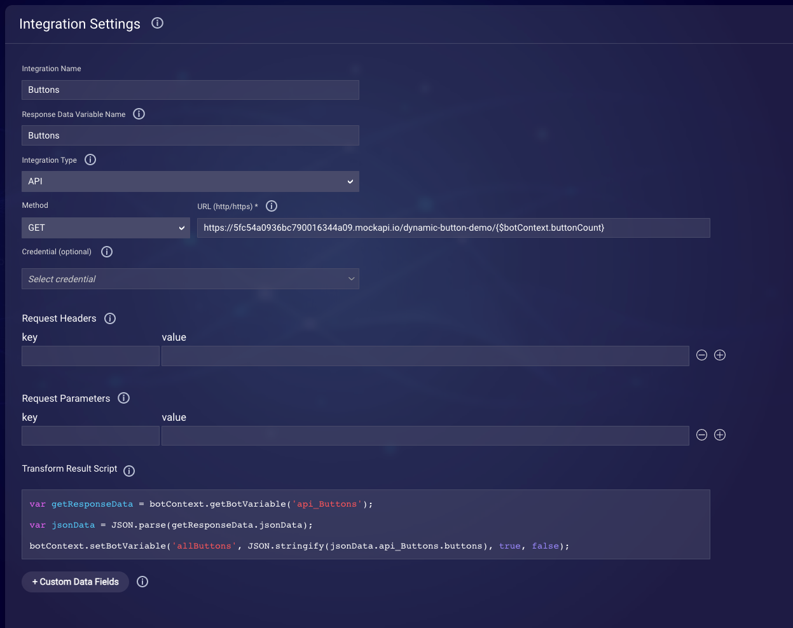
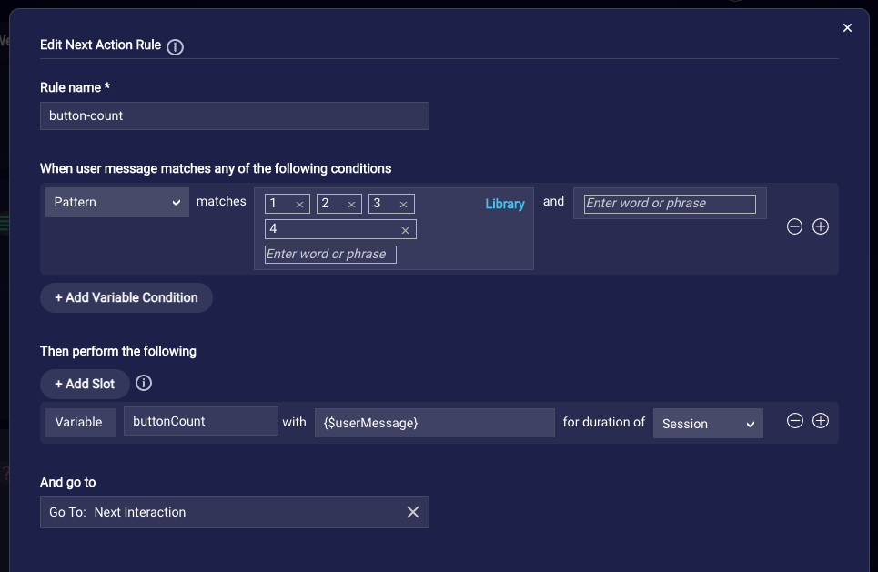
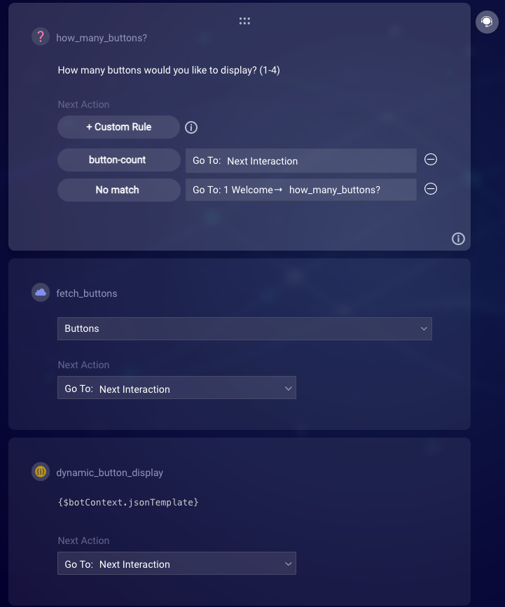
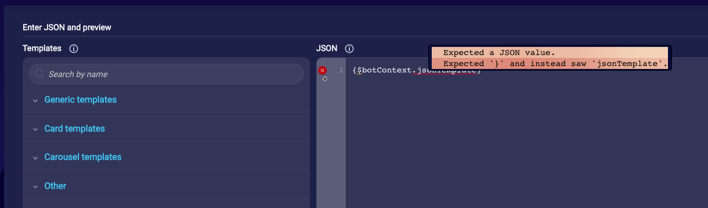
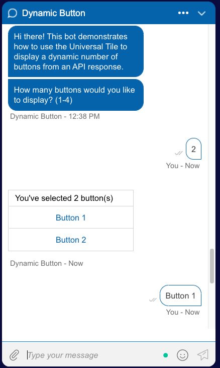
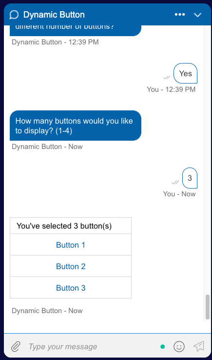

# Dynamic Buttons using the Universal Tile

> **Note**: This guide originally appeared in the [LivePerson developer forum](https://talkyard.livepersonai.com/-78/creating-dynamic-buttons-using-the-universal-tile).

A limitation of Conversation Builder's button and structured content interactions has been the inability to show a dynamic number of buttons based on an API's response. These interactions require a static number of buttons to be set when creating the interaction. Workarounds typically involve creating multiple interactions of the same type and purpose with a differing number of buttons. This results in a substantial amount of duplicated work and can be difficult to maintain.

Creating these interactions using the Universal Tile can provide this functionality without duplicating the interactions. This guide shows an example of this functionality by manually processing the API response and using JavaScript to construct a JSON object to be passed to the Universal Tile.

## Processing the API Response

To demonstrate, I've created a mock API which will return a differing number of buttons based on the `buttonCount` variable (1-4).

`https://5fc54a0936bc790016344a09.mockapi.io/dynamic-button-demo/{$botContext.buttonCount}`

In the transform result script for the API integration, manually process the API response using JavaScript. Save the buttons object to a new bot variable, `allButtons`.

```js
var getResponseData = botContext.getBotVariable('api_Buttons');
var jsonData = JSON.parse(getResponseData.jsonData);
botContext.setBotVariable('allButtons', JSON.stringify(jsonData.api_Buttons.buttons), true, false);
```



In my example bot, I've created a **text question** which collects the number of buttons to display for the user and saves that value to the `buttonCount` variable.



## Creating the Universal Tile JSON



After we pass the `buttonCount` to the `Buttons` integration, create a **Universal** interaction which includes the following code in its pre-process code:

```js
var buttonCount = botContext.getBotVariable('buttonCount');
var allButtons = JSON.parse(botContext.getBotVariable('allButtons'));
var cardElements = [
  {
    "type": "text",
    "text": "You've selected " + buttonCount + " button(s)",
    "tooltip": buttonCount + " button(s)"
  }
];
for (var i = 0; i < allButtons.length; i++) {
  var element = {
    "type": "button",
    "title": allButtons[i].label,
    "click": {
      "actions": [
        {
          "type": "publishText",
          "text": allButtons[i].payload
        }
      ]
    },
    "tooltip": allButtons[i].label
  };
  cardElements.push(element);
}

var json = {
  "type": "vertical",
  "elements": cardElements
};

botContext.setBotVariable('jsonTemplate', JSON.stringify(json), true, false);
```

In this code, we programmatically create a compatible JSON object which will display a dynamic number of buttons based on the response from the API. We loop through the API results, creating a new [Universal element](https://developers.liveperson.com/getting-started-with-rich-messaging-introduction.html) for each button to display.

Once we've created the JSON object, stringify it and save it to a bot variable, `jsonTemplate`.

In the Universal Tile's JSON editor, insert `{$botContext.jsonTemplate}`. Note that while there will be a linter error that states that the variable is not a JSON value, you will be able to save this interaction and it will resolve to valid JSON when displaying to the user.



With this interaction saved, test the dialog by deploying to a web messaging engagement to see the dynamic button display in action.

> **Note**: This interaction will not properly display in the Conversation Builder previewer. You will need to deploy to a web messaging engagement in order to see the functionality.



Please see the included `dynamic-button-bot.json` bot template to import and test in your own account.
