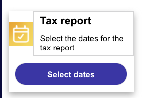
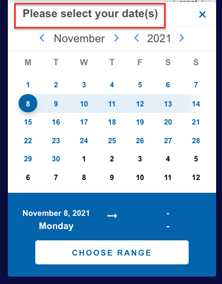
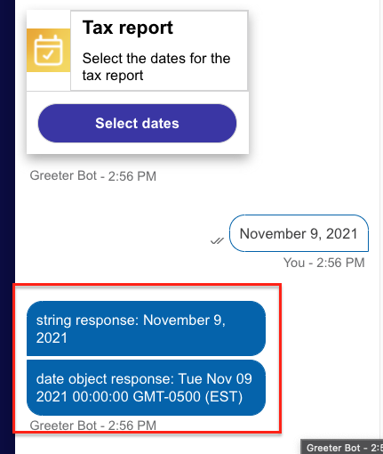
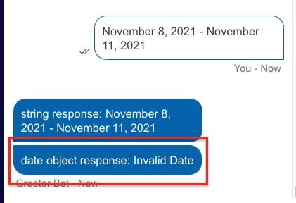
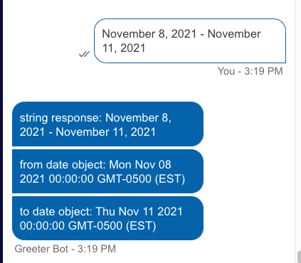
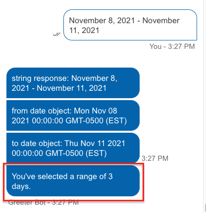

# Using the Date Picker Template

Using the Universal Interaction, bot builders can provide a calendar interface to their users, which simplifies collecting dates for various purposes. The [Date Picker Template](https://github.com/LivePersonInc/ConversationBuilder-Samples/tree/main/universal-tile-templates/web-messaging-templates/date-picker) sends users a simple button interaction that, when selected, presents the user with a calendar widget for them to select dates. Documentation for the template customization is found on the [LivePerson Developers Page](https://developers.liveperson.com/mobile-sdk-and-web-templates-date-picker-template.html).

## Displaying the Calendar Widget



A button to display a calendar can be added to any universal interaction. All universal button interactions contain a `click` element which typically sends either a `publishText` or `link` action type back to the bot. To use the button to generate the calendar widget, you must add the string `datePicker` as your `type` property in the button's `action` object.

```js
{
  "type": "button",
  "tooltip": "button tooltip",
  "title": "Select dates",
  "class": "button",
  "style": {
    "background-color": "#3736A6",
    "color": "#ffffff",
    "size": "medium",
    "bold": true
  },
  "click": {
    "actions": [
      {
        "type": "datePicker",
        "class": "range",
        "title": "Please select your date(s)",
        "dateFormat": "DD-MM-YYYY"
      }
    ]
  }
}
```

For a `datePicker` click action type, several unique properties can be added to customize the experience for the user. Two of these properties are **required** any time you want to present this option for your users:

* `title`
* `class`

The `title` property is self-explanatory and is the text that your users will see when the calendar is displayed.



For the `class` property, you must assign one of two values that dictate the desired behavior of the calendar selection widget. This property expects either a string of `single` or `range` depending on whether you want to collect a single date or a range of dates. Please note that whichever value you choose will impact how the user can work with the calendar in selecting dates. A `single` value cannot be used for multiple dates, and a `range` value cannot be used to select a single date (must include at least two sequential dates).

After a user makes their selection and taps the **CHOOSE RANGE** button, the date selection is sent to the bot for processing.

## Processing the User Response


Whether a user selects a single date or multiple dates, the response is sent back to the bot as a string. If you intend to do some processing in the bot based on the date value, it may be beneficial to convert the string into a [JavaScript Date object](https://developer.mozilla.org/en-US/docs/Web/JavaScript/Reference/Global_Objects/Date).

To convert the date string into a date object, you'll need to use some custom JavaScript in the Process User Response code section of the universal interaction. Use the following code in the Process User Response to see an example of the transformation:

```js
var response = botContext.getCurrentUserMessage();
botContext.sendMessage('string response: ' + response);
var dateObjResponse = new Date(response);
botContext.sendMessage('date object response: ' + dateObjResponse);
```



You can use the various JavaScript Date methods to work with the returned value more efficiently by converting the response to a date object.

> **Note**: Some JS Date methods may not be supported within Conversation Builder.

### Working with a range of dates

As mentioned previously, the interaction sends a string response to the bot after the user makes their selection. When a user selects a range of dates, the bot returns both dates in a single string delimited by ` - `.The following screenshot highlights the issue caused when attempting to use the previous code on a range of dates.



As such, additional processing will need to occur if you intend to create new date objects from the start and end of the date range. To do so, you will need to first split the response string on `' - '` and then create each object individually.

```js
var response = botContext.getCurrentUserMessage();
botContext.sendMessage('string response: ' + response);
var dateRange = response.split(' - ');
var fromDateString = dateRange[0];
var toDateString = dateRange[1];
var fromDateObj = new Date(fromDateString);
var toDateObj = new Date(toDateString);
botContext.sendMessage('from date object: ' + fromDateObj);
botContext.sendMessage('to date object: ' + toDateObj);
```



Once the dates are separated and converted into Date objects, you can work with them as needed using JavaScript.

```js
var diffTime = toDateObj - fromDateObj;
var diffDays = diffTime / (1000 * 60 * 60 * 24);
botContext.sendMessage("You've selected a range of " + diffDays + " days.");
```



> **Note**: When working with the JavaScript Date objects, the differences will be calculated based on milliseconds, which may require additional work to process correctly (ex: `diffTime / (1000 * 60 * 60 * 24)`).
