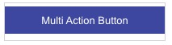

# Multi Action Button

This template renders a button which performs two actions when clicked. The button sends the text "Button Clicked!" to the bot and directs the user to [https://www.liveperson.com](https://www.liveperson.com).



```json
{
  "title": "Multi Action Button",
  "tooltip": "Click me!",
  "type": "button",
  "style": {
    "color": "#FFF",
    "background-color": "#3E47A0",
    "size": "medium"
  },
  "click": {
    "actions": [
      {
        "type": "publishText",
        "text": "Button Clicked!"
      },
      {
        "type": "link",
        "uri": "https://www.liveperson.com",
        "target": "blank"
      }
    ]
  }
}

```
