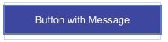

# Button With Message

This template renders a button which performs a single "publishText" action when clicked. Clicking this button will send the text "Button Clicked!" to the bot.



```json
{
  "title": "Button with Message",
  "tooltip": "Click me!",
  "type": "button",
  "style": {
    "color": "#FFF",
    "background-color": "#3E47A0",
    "size": "medium"
  },
  "click": {
    "actions": [
      {
        "type": "publishText",
        "text": "Button Clicked!"
      }
    ]
  }
}

```
