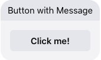

# Facebook Button With Message

This template renders a title and button which performs a single "publishText" action when clicked. Clicking this button will send the text "Button Clicked!" to the bot.

> **Note**: The visible response shown in the conversation will be whatever is listed as the button element's title (ex: "Click me!"). However, the "click" action will send to the bot whatever is listed as the text of the action object (ex: "Button Clicked!"). The bot should be configured to process the payload from the action object and not the title of the button.



```json
{
  "type": "vertical",
  "elements": [
    {
      "type": "vertical",
      "elements": [
        {
          "type": "text",
          "tooltip": "Button with Message",
          "tag": "title",
          "text": "Button with Message"
        },
        {
          "title": "Click me!",
          "tooltip": "Click me!",
          "type": "button",
          "click": {
            "actions": [
              {
                "type": "publishText",
                "text": "Button Clicked!"
              }
            ]
          }
        }
      ]
    }
  ],
  "tag": "button"
}
```
