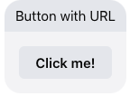

# Facebook Button With URL

This template renders a title and button which performs a single "link" action when clicked. Clicking this button will navigate the user to [https://www.liveperson.com](https://www.liveperson.com) in a new tab. More information on Facebook button templates can be found in our [developer documentation](https://developers.liveperson.com/facebook-messenger-templates-button-template.html) and [Facebook's button template reference](https://developers.facebook.com/docs/messenger-platform/reference/templates/button).

> **Note**: To display this interaction, all URL domains for button links must be whitelisted on the Facebook platform. Please see [our documentation](https://developers.liveperson.com/facebook-messenger-templates-introduction.html#facebook-messenger-setup) for guidance on how to whitelist domains in Facebook.



```json
{
  "type": "vertical",
  "elements": [
    {
      "type": "vertical",
      "elements": [
        {
          "type": "text",
          "tooltip": "Button with URL",
          "tag": "title",
          "text": "Button with URL"
        },
        {
          "title": "Click me!",
          "tooltip": "Click me!",
          "type": "button",
          "click": {
            "actions": [
              {
                "type": "link",
                "uri": "https://www.liveperson.com",
                "target": "blank"
              }
            ]
          }
        }
      ]
    }
  ],
  "tag": "button"
}
```
