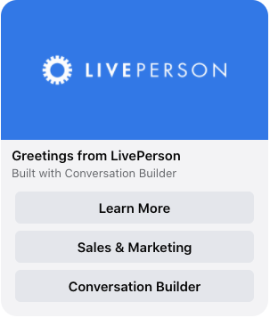

# Facebook Generic Template

This template renders a generic structured card message that includes a text title, subtitle, image and three buttons that link to distinct web pages. More information on Facebook Generic Templates can be found in our [developer documentation](https://developers.liveperson.com/facebook-messenger-templates-generic-template.html) and [Facebook's generic template reference](https://developers.facebook.com/docs/messenger-platform/reference/templates/generic).

> **Note**: To display this interaction, all URL domains for button links must be whitelisted on the Facebook platform. Please see [our documentation](https://developers.liveperson.com/facebook-messenger-templates-introduction.html#facebook-messenger-setup) for guidance on how to whitelist domains in Facebook.



```json
{
  "type": "vertical",
  "tag": "generic",
  "elements": [
    {
      "type": "vertical",
      "elements": [
        {
          "type": "image",
          "url": "https://i.imgur.com/7nSKrd0.png",
          "tooltip": "image"
        },
        {
          "type": "text",
          "tag": "title",
          "text": "Greetings from LivePerson",
          "tooltip": "Title"
        },
        {
          "type": "text",
          "tag": "subtitle",
          "text": "Built with Conversation Builder",
          "tooltip": "subtitle"
        },
        {
          "title": "Learn More",
          "tooltip": "Click me!",
          "type": "button",
          "click": {
            "actions": [
              {
                "type": "link",
                "uri": "https://www.liveperson.com",
                "target": "blank"
              }
            ]
          }
        },
        {
          "title": "Sales & Marketing",
          "tooltip": "Click me!",
          "type": "button",
          "click": {
            "actions": [
              {
                "type": "link",
                "uri": "https://www.liveperson.com/solutions/sales-and-marketing",
                "target": "blank"
              }
            ]
          }
        },
        {
          "title": "Conversation Builder",
          "tooltip": "Click me!",
          "type": "button",
          "click": {
            "actions": [
              {
                "type": "link",
                "uri": "https://www.liveperson.com/products/conversation-builder",
                "target": "blank"
              }
            ]
          }
        }
      ]
    }
  ]
}
```
