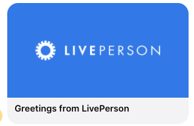

# Facebook Image Only

This template renders a generic image interaction which contains an image along with a title. More information on Facebook Generic Templates can be found in our [developer documentation](https://developers.liveperson.com/facebook-messenger-templates-generic-template.html) and [Facebook's generic template reference](https://developers.facebook.com/docs/messenger-platform/reference/templates/generic).



```json
{
    "type": "vertical",
    "elements": [
      {
        "type": "vertical",
        "elements": [
                  {
            "type": "text",
            "tooltip": "",
            "tag": "title",
            "text": "Greetings from LivePerson"
          },
          {
            "type": "image",
            "url": "https://i.imgur.com/7nSKrd0.png"
          }
        ]
      }
    ],
    "tag": "generic"
  }
  
```
