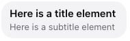

# Facebook Text Only

This template renders a generic text interaction containing a "Title" and "Subtitle" elements. More information on Facebook Generic Templates can be found in our [developer documentation](https://developers.liveperson.com/facebook-messenger-templates-generic-template.html) and [Facebook's Generic Template reference](https://developers.facebook.com/docs/messenger-platform/reference/templates/generic).

> **Note**: Universal Tile text interactions in Facebook require a "Title" as well as a second element (subtitle, button, etc) in order to render properly. Additionally, this interaction is limited to a single "Subtitle" element. Additions of additional Subtitle elements will resort in the last one in the elements array being shown to the user.



```json
{
    "type": "vertical",
    "elements": [
      {
        "type": "vertical",
        "elements": [
          {
            "type": "text",
            "tooltip": "Nice to see you!",
            "tag": "title",
            "text": "Here is a title element"
          },
          {
            "type": "text",
            "tooltip": "Here is your subtitle",
            "tag": "subtitle",
            "text": "Here is a subtitle element"
          }
        ]
      }
    ],
    "tag": "generic"
}
  
```
