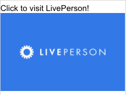

# Image Multi Action

This template renders an image which performs two actions when clicked. The button sends the text "Image Clicked!" to the bot and directs the user to [https://www.liveperson.com](https://www.liveperson.com).

**Note**: When using in a deployed web messaging bot, the URL `https://i.imgur.com` will need to be whitelisted to display the image.



```json
{
  "type": "image",
  "url": "https://i.imgur.com/7nSKrd0.png",
  "caption": "Click to visit LivePerson!",
  "tooltip": "Click here!",
  "click": {
    "actions": [
      {
        "type": "publishText",
        "text": "Image Clicked!"
      },
      {
        "type": "link",
        "name": "LivePerson",
        "uri": "https://www.liveperson.com"
      }
    ]
  }
}

```
