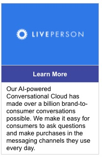

# Image With Button And Text

This template renders a vertically formatted image, button, and text card. Clicking on the button triggers a "link" action which navigates the user to [https://www.liveperson.com](https://www.liveperson.com).

**Note**: When using in a deployed web messaging bot, the URL `https://i.imgur.com` will need to be whitelisted to display the image.



```json
{
  "type": "vertical",
  "tag": "generic",
  "elements": [
    {
      "type": "vertical",
      "elements": [
        {
          "type": "image",
          "url": "https://i.imgur.com/7nSKrd0.png"
        },
        {
          "type": "button",
          "style": {
            "bold": true,
            "color": "#FFF",
            "background-color": "#3E47A0",
            "size": "medium"
          },
          "title": "Learn More",
          "click": {
            "actions": [
              {
                "type": "link",
                "uri": "https://www.liveperson.com"
              }
            ],
            "metadata": []
          }
        },
        {
          "type": "text",
          "tag": "title",
          "text": "Our AI-powered Conversational Cloud has made over a billion brand-to-consumer conversations possible. We make it easy for consumers to ask questions and make purchases in the messaging channels they use every day."
        }
      ]
    }
  ]
}

```
