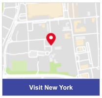

# Map With Button



```json
{
  "type": "vertical",
  "tag": "generic",
  "elements": [
    {
      "type": "vertical",
      "elements": [
        {
          "type": "map",
          "la": 40.7562057,
          "lo": -73.9985918,
          "tooltip": "You are here!"
        },
        {
          "type": "button",
          "style": {
            "bold": true,
            "color": "#FFF",
            "background-color": "#3E47A0",
            "size": "medium"
          },
          "title": "Visit New York",
          "click": {
            "actions": [
              {
                "type": "link",
                "uri": "https://www.google.com/maps/place/New+York,+NY/@40.697403,-74.1201051,11z"
              }
            ]
          }
        }
      ]
    }
  ]
}

```
