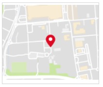

# Map With URL

This template renders a single map image, displaying the map for the provided `la` & `lo` coordinates (latitude & longitude). Clicking on the map image triggers a "link" action which navigates the user to a provided URI. This template overwrites the default map click behavior and is useful when you want to navigate to a different web page on click.



```json
{
  "type": "map",
  "la": 40.7562057,
  "lo": -73.9985918,
  "tooltip": "Click for New York",
  "click": {
    "actions": [
      {
        "type": "link",
        "name": "LivePerson",
        "uri": "https://www.google.com/maps/place/New+York,+NY/@40.697403,-74.1201051,11z"
      }
    ]
  }
}

```
