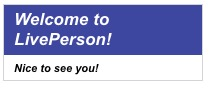

# Text Multiple

This template renders two text interactions on top of each other. Each text interaction is presented with different style properties to show the ways in which the interaction can be configured.

For more details on the styling options available, please see our [developer documentation](https://developers.liveperson.com/getting-started-with-rich-messaging-introduction.html#element-styling).



```json
{
  "type": "vertical",
  "elements": [
    {
    "type": "text",
    "text": "Welcome to LivePerson!",
        "tooltip": "Welcome!",
    "style": {
        "bold": true,
        "italic": true,
        "color": "#FFF",
        "background-color": "#3E47A0",
        "size": "large"
        }
    },
    {
    "type": "text",
    "text": "Nice to see you!",
        "tooltip": "",
    "style": {
        "bold": true,
        "italic": true,
        "color": "#000",
        "background-color": "#FFF",
        "size": "small"
        }
    }
  ]
}

```
