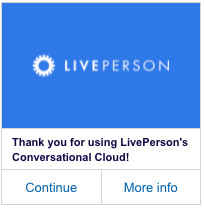

# Vertical Card With Horizontal Buttons

This tempalate renders a vertically formatted image, text, and button card containing two horizontally aligned buttons. Clicking on the "Continue" button triggers a "publishText" action, sending the word "Continue" to the bot. Clicking "More info" triggers a multi-action event, sending "More info" to the bot and navigating the user to [https://www.liveperson.com](https://www.liveperson.com).

**Note**: When using in a deployed web messaging bot, the URL `https://i.imgur.com` will need to be whitelisted to display the image.



```json
{
  "type": "vertical",
  "elements": [
    {
      "type": "image",
      "url": "https://i.imgur.com/7nSKrd0.png",
      "click": {
        "actions": [
          {
            "type": "link",
            "uri": "https://www.liveperson.com",
            "target": "blank"
          }
        ]
      }
    },
    {
      "type": "text",
      "text": "Thank you for using LivePerson's Conversational Cloud!",
      "tooltip": "Thanks!",
      "style": {
        "bold": true,
        "size": "small",
        "color": "#0F0943",
        "background-color": "#FFF"
      }
    },
    {
      "type": "horizontal",
      "elements": [
        {
          "title": "Continue",
          "type": "button",
          "click": {
            "actions": [
              {
                "type": "publishText",
                "text": "Continue"
              }
            ]
          },
          "tooltip": "Continue to next interaction."
        },
        {
          "title": "More info",
          "type": "button",
          "click": {
            "actions": [
              {
                "type": "link",
                "uri": "https://www.liveperson.com",
                "target": "blank"
              },
              {
                "type": "publishText",
                "text": "More info"
              }
            ]
          },
          "tooltip": "liveperson.com"
        }
      ]
    }
  ]
}

```
