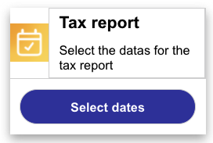
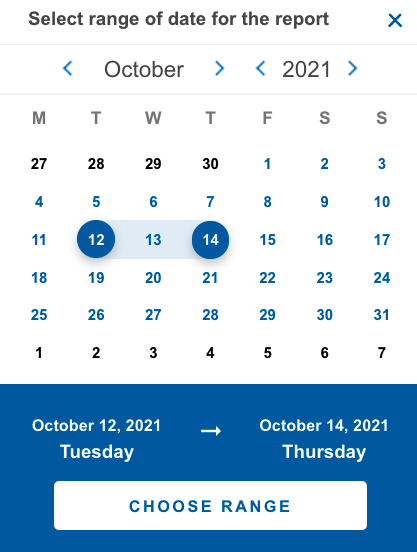

# Date Picker

This template renders a button which expands into a date picker interaction. The date picker interaction accepts a range of dates, sent back as a string to the bot. For more information on configuration of the date picker interaction, please see our [Date Picker Template documentation](https://developers.liveperson.com/mobile-sdk-and-web-templates-date-picker-template.html).



```json
{
  "type": "vertical",
  "border": "dropShadow",
  "elements": [
    {
      "type": "horizontal",
      "borderLine": false,
      "percentages": [
        20,
        80
      ],
      "elements": [
        {
          "type": "image",
          "url": "https://i.imgur.com/g8rGeLB.png",
          "tooltip": "image tooltip"
        },
        {
          "type": "vertical",
          "elements": [
            {
              "type": "text",
              "text": "Tax report",
              "tooltip": "text tooltip",
              "style": {
                "bold": true,
                "size": "large"
              }
            },
            {
              "type": "text",
              "text": "Select the dates for the tax report",
              "tooltip": "text tooltip"
            }
          ]
        }
      ]
    },
    {
      "type": "button",
      "tooltip": "button tooltip",
      "title": "Select dates",
      "class": "button",
      "style": {
        "background-color": "#3736A6",
        "color": "#ffffff",
        "size": "medium",
        "bold": true
      },
      "click": {
        "actions": [
          {
            "type": "datePicker",
            "class": "range",
            "title": "Select range of date for the report",
            "dateFormat": "DD-MM-YYYY"
          }
        ]
      }
    }
  ]
}
```
