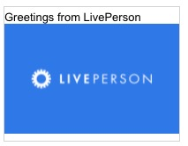

# Image With Caption

This template renders a single image along with a caption, "Greatings from LivePerson". This template does not contain a "click" action type for the image.

**Note**: When using in a deployed web messaging bot, the URL `https://i.imgur.com` will need to be whitelisted to display the image.



```json
{
  "type": "image",
  "url": "https://i.imgur.com/7nSKrd0.png",
  "caption": "Greetings from LivePerson",
  "tooltip": "LivePerson Image",
  "click": {}
}

```
