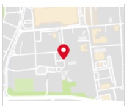

# Map Only

This template renders a single map image, displaying the map for the provided `la` & `lo` coordinates (latitude & longitude). Clicking on the map image opens the location in Google Maps in a new browser tab.



```json
{
  "type": "map",
  "la": 40.7562057,
  "lo": -73.9985918,
  "tooltip": "map tooltip"
}

```
